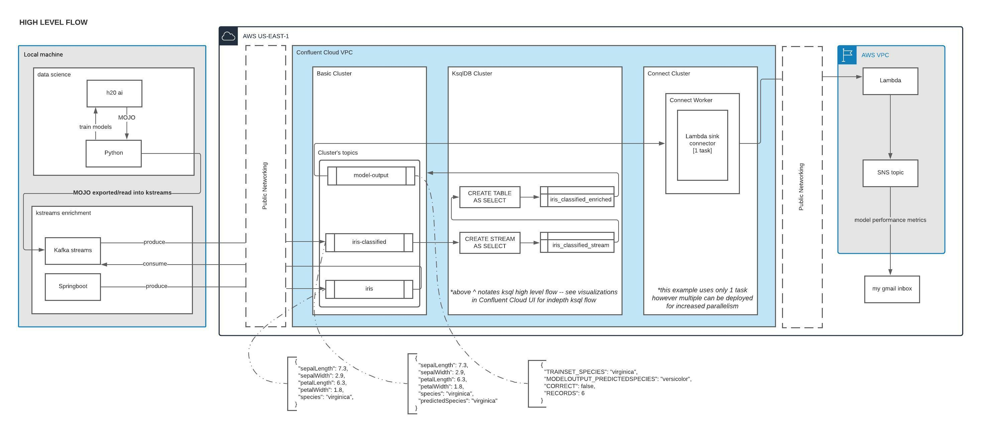
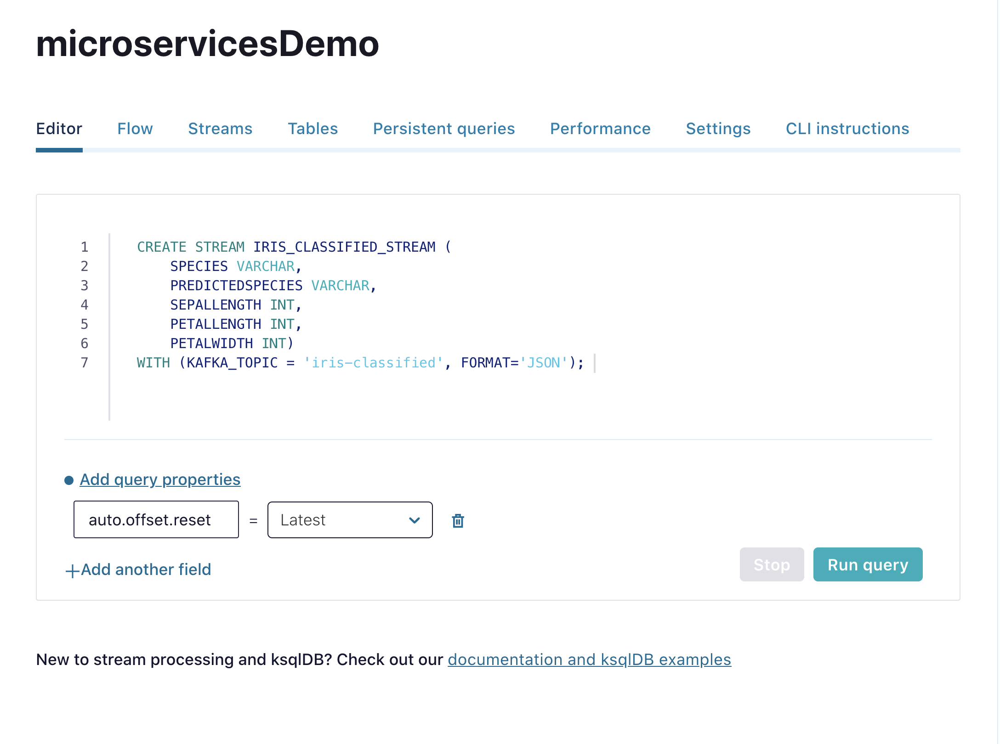
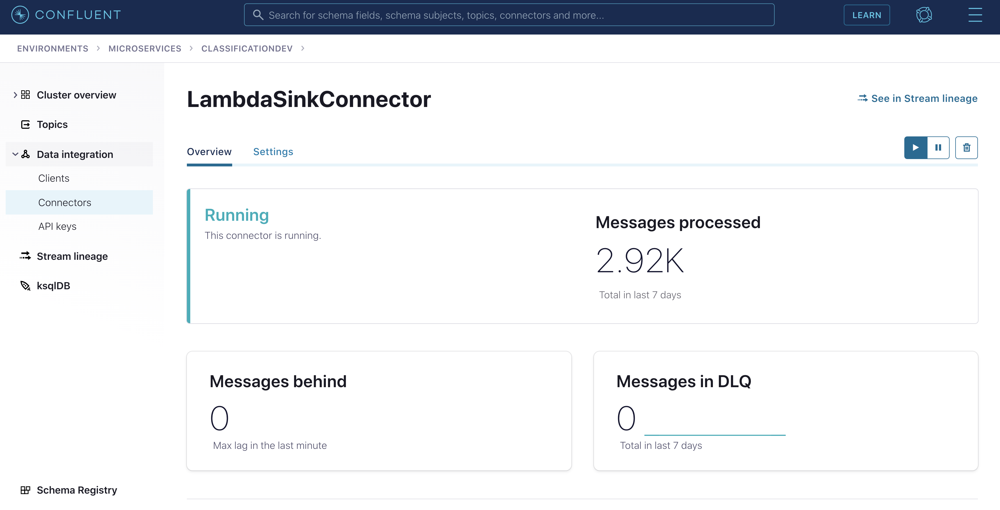

# Embed multi-classification machine learning model in a streaming pipeline demo with Confluent Cloud and AWS Lambda/SNS 

In this demo, I will show how to easily run your microservices against Confluent Cloud -- a cloud native fully managed kafka solution. Through a combination of services -- notably kafka streams, python, and springboot -- I will show how data science model predictions can be continuously generated as new data flows through the Confluent Cloud cluster. I will evaluate model predictions through Confluent Cloud’s fully managed stream processing tool -- ksqlDB -- and kick off alerts on model performance through AWS lambdas. 



# Prerequisities
1. Basic cluster in Confluent Cloud 
2. Ksqldb cluster in Confluent Cloud 

** note ccloud stack will automate spinning up of items 1&2 --> [ccloud stack](https://docs.confluent.io/platform/current/tutorials/examples/ccloud/docs/ccloud-stack.html) 

4. [Lambda sink connector in Confluent Cloud](https://docs.confluent.io/cloud/current/connectors/cc-aws-lambda-sink.html) 
5. [Confluent Cloud CLI](https://docs.confluent.io/ccloud-cli/current/install.html) 
6. java11 (set JAVA_HOME)
7. AWS Lambda  
8. AWS SNS 

This example is based on the famous [iris dataset](https://en.wikipedia.org/wiki/Iris_flower_data_set), which is a classic multi-classification problem where four numerical covariates (i.e. petal/sepal lengths and widths) are used to predict the iris species (i.e. setosa, versicolor, and virginica).


There are two parts to this example:
1. a Java Spring app that randomly streams records from the iris dataset to a topic: `iris` which is in a Confluent Cloud cluster.
2. a Kafka Streams app that consumes records from the `iris` topic, predicts the iris species, and outputs those preductions to another topic: `iris-classified`:

To run this in your environment, you'll want to edit the values in the following two properties files:
 - `kafka-iris-data/src/main/resources/application.properties`
 - `kstreams-iris-classification/src/main/resources/config.properties`

Specifically update the following: 
1. update `bootstrap.servers` and `sasl.jass.config` in the following file to match your Confluent Cloud cluster: kstreams-iris-classification/src/main/resources/config.properties
2. And you can set global env variables in your IDE for the other application.config file to pick them up (see kafka-iris-data/src/main/resources/application.properties)

# Ksqldb 

After you've spun up a ksqldb app, started the spring app and kafka streams app, next you'll want to create some streams and tables in ksqldb. Referring to the diagram above, we should have a "iris-classified" topic in your Confluent Cloud cluster -- this is holding the output of our data science team (has predicted species field in message payload). Using ksqldb, we will do some aggregations to tell us when the model is correct or not: 

```
CREATE STREAM IRIS_CLASSIFIED_STREAM (
	SPECIES VARCHAR,
	PREDICTEDSPECIES VARCHAR,
	SEPALLENGTH INT,
	PETALLENGTH INT,
	PETALWIDTH INT)
WITH (KAFKA_TOPIC = 'iris-classified', FORMAT='JSON');
``` 

We first create a stream based on iris-classified topic, simply paste that query in the ksqldb editor and hit "submit query" i.e. 

 

Then we create a table based on that stream, again just drop into the editor and plug in your query and submit. This one is a bit more involved because I want to 
execute that predicate for evaluating my model performance within this query. This query will output the model result to a new topic called "model-output". I will use this topic to then feed the AWS lambda sink connector. 

```
CREATE TABLE IRIS_CLASSIFIED_ENRICHED WITH (kafka_topic='model-output', format='JSON') AS SELECT
	SPECIES, AS_VALUE(SPECIES) AS TRAINSET_SPECIES,
	PREDICTEDSPECIES, AS_VALUE(PREDICTEDSPECIES) AS MODELOUTPUT_PREDICTEDSPECIES,
	CASE WHEN SPECIES = PREDICTEDSPECIES THEN TRUE ELSE FALSE END AS CORRECT,
	count(*) AS RECORDS
	FROM IRIS_CLASSIFIED_STREAM
	GROUP BY SPECIES, PREDICTEDSPECIES;
``` 
# AWS SNS 

You will need to spin up SNS topic in your AWS console and subscribe to that SNS topic. Docs [here](https://docs.aws.amazon.com/sns/latest/dg/sns-getting-started.html). Copy your SNS topic ARN for pasting into the Lambda query in the next section. 

# AWS Lambda   

In your AWS console, spin up a new Lambda Python app. I used python3.7 in this example -- see [here](https://docs.aws.amazon.com/lambda/latest/dg/lambda-python.html) for AWS docs on spinning up Lambda. Once you have that up, here's the query I used: 

```
from __future__ import print_function
import boto3
import base64
import json

client = boto3.client('sns')
# Include your SNS topic ARN here.
topic_arn = <'INSERT_YOUR_TOPIC_ARN_HERE'>

def lambda_handler(event, context):
        uncoded_payload = json.dumps(event)
        #payload = base64.b64decode(uncoded_payload)
        payload = uncoded_payload
        print(payload)
        client.publish(TopicArn=topic_arn, Message=payload, Subject='Sent from Confluent Cloud')
```

# Lambda sink connector 

Setting up the sink connector is relatively simple -- referring to the link in the prequisties to get the connector spun up. The topic we want to select as input for the connector will be "model-output." The full config for my connector looks like this, you can gut check it against your connector when you get to step 2 (i.e. "test and verify") in the connector setup UI flow 

```
{
  "name": "LambdaSinkConnector",
  "config": {
    "topics": "model-output",
    "input.data.format": "JSON",
    "connector.class": "LambdaSink",
    "name": "LambdaSinkConnector",
    "aws.lambda.function.name": "modelPerformance",
    "aws.lambda.invocation.type": "sync",
    "aws.lambda.batch.size": "1",
    "tasks.max": "1"
  }
}
```
The connector will take ~15-45min. to spin up, once you see the connector in running state then you can move on i.e. 



# Email confirmation 
If everything is working up to this point, you should start to get a lot of emails from the SNS topic with the subject "Sent from Confluent Cloud"

----- 
### Nice to know appendix: 

The ML model was generated using h2o's AutoML function in a few lines of Python:

    import h2o
    from h2o.automl import H2OAutoML
    
    h2o.init()
    iris = h2o.import_file('/Users/alex.woolford/iris.csv')
    
    train, test = iris.split_frame(ratios=[.8], seed=1234)
    
    x = train.columns
    y = "species"
    x.remove(y)
    
    aml = H2OAutoML(max_models=20, seed=1)
    aml.train(x=x, y=y, training_frame=train)
    
    lb = aml.leaderboard
    lb.head(rows=lb.nrows)
    
    aml.leader.download_mojo(path="/Users/alex.woolford/kstreams-h2o-example/kstreams-iris-classification/src/main/resources/", get_genmodel_jar=False)

The AutoML function takes a dataset, creates a variety of predictive models, and then compares the performance of those models in a leaderboard:

    model_id                                               mean_per_class_error    logloss      rmse        mse
    ---------------------------------------------------  ----------------------  ---------  --------  ---------
    DeepLearning_grid_1_AutoML_20190611_070229_model_2                0.0367021  0.165721   0.181637  0.0329919
    XRT_1_AutoML_20190611_070229                                      0.0379433  0.364826   0.181471  0.0329317
    GLM_grid_1_AutoML_20190611_070229_model_1                         0.0391844  0.0801216  0.15954   0.0254531
    DeepLearning_grid_1_AutoML_20190611_070229_model_1                0.0391844  0.231292   0.1915    0.0366723
    XGBoost_grid_1_AutoML_20190611_070229_model_4                     0.0404255  0.207108   0.222968  0.0497148
    XGBoost_1_AutoML_20190611_070229                                  0.0404255  0.217355   0.222782  0.0496319
    DRF_1_AutoML_20190611_070229                                      0.0450355  0.364836   0.181338  0.0328835
    StackedEnsemble_AllModels_AutoML_20190611_070229                  0.0462766  0.201319   0.217433  0.0472771
    GBM_grid_1_AutoML_20190611_070229_model_2                         0.0462766  0.424053   0.220497  0.048619
    StackedEnsemble_BestOfFamily_AutoML_20190611_070229               0.0462766  0.201696   0.21085   0.0444579
    GBM_3_AutoML_20190611_070229                                      0.0475177  0.149882   0.205184  0.0421004
    GBM_4_AutoML_20190611_070229                                      0.0475177  0.149882   0.205184  0.0421004
    XGBoost_grid_1_AutoML_20190611_070229_model_2                     0.0475177  0.186174   0.214231  0.0458951
    XGBoost_grid_1_AutoML_20190611_070229_model_1                     0.0475177  0.224382   0.229571  0.0527027
    XGBoost_3_AutoML_20190611_070229                                  0.0475177  0.313769   0.280067  0.0784375
    GBM_1_AutoML_20190611_070229                                      0.0475177  0.167198   0.207615  0.0431041
    GBM_2_AutoML_20190611_070229                                      0.0475177  0.149214   0.204935  0.0419982
    XGBoost_grid_1_AutoML_20190611_070229_model_3                     0.0475177  0.445682   0.362214  0.131199
    DeepLearning_grid_1_AutoML_20190611_070229_model_3                0.0530536  0.139576   0.205659  0.0422956
    GBM_grid_1_AutoML_20190611_070229_model_1                         0.0546099  0.208507   0.227649  0.0518243
    DeepLearning_1_AutoML_20190611_070229                             0.0746454  0.261534   0.270665  0.0732594
    XGBoost_2_AutoML_20190611_070229                                  0.0796099  0.522832   0.409302  0.167528

The most accurate model is then downloaded as a "MOJO" (Model ObJect, Optimized), and deployed in a Kafka Streams app.

The model outputs data to a couple of topics. `iris-classified` contains the predictions:

    # kafka-console-consumer --bootstrap-server localhost:9092 --topic iris-classified
    {"sepalLength":6.7,"sepalWidth":3.3,"petalLength":5.7,"petalWidth":2.5,"species":"virginica","predictedSpecies":"virginica"}
    {"sepalLength":6.5,"sepalWidth":3.0,"petalLength":5.5,"petalWidth":1.8,"species":"virginica","predictedSpecies":"virginica"}
    {"sepalLength":6.3,"sepalWidth":2.3,"petalLength":4.4,"petalWidth":1.3,"species":"versicolor","predictedSpecies":"versicolor"}
    {"sepalLength":5.8,"sepalWidth":4.0,"petalLength":1.2,"petalWidth":0.2,"species":"setosa","predictedSpecies":"setosa"}
    {"sepalLength":4.6,"sepalWidth":3.1,"petalLength":1.5,"petalWidth":0.2,"species":"setosa","predictedSpecies":"setosa"}

And `iris-classified-window-counts` shows per-minute counts for each actual/predicted pair:

    # kafka-console-consumer --bootstrap-server localhost:9092 --topic iris-classified-window-counts
    {"species":"versicolor","predictedSpecies":"virginica","startMs":1604302260000,"endMs":1604302320000,"count":1}
    {"species":"versicolor","predictedSpecies":"versicolor","startMs":1604302260000,"endMs":1604302320000,"count":10}
    {"species":"setosa","predictedSpecies":"setosa","startMs":1604302260000,"endMs":1604302320000,"count":14}
    {"species":"virginica","predictedSpecies":"virginica","startMs":1604302260000,"endMs":1604302320000,"count":19}

The Kafka Streams app can be scaled horizontally across multiple instances in order to meet whatever throughput is required.

Here's a diagram of the topology that was generated by the [Kafka Streams Topology Viewer](https://zz85.github.io/kafka-streams-viz/) tool:


